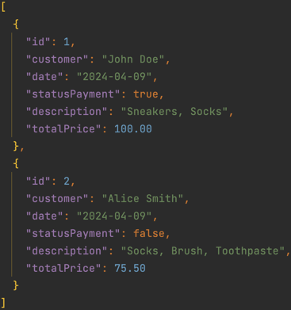
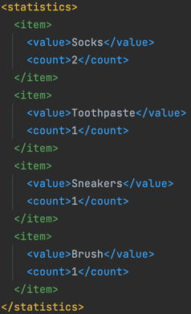
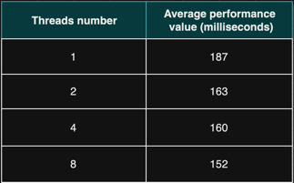
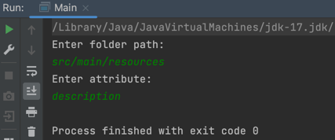
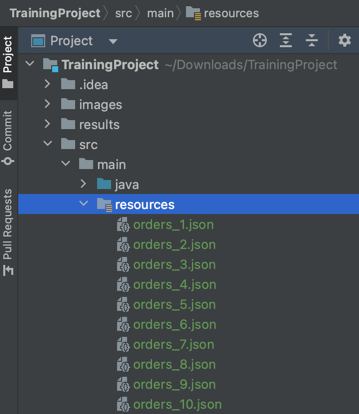

# 📄 File Statistics Generator ⚙️

### ⚡️ Project description
This is a console script program that parses JSON files of the main entity and generates statistics (total number) 
in terms of one of its attributes. 
As launch parameters, it receives the path to the folder where the JSON files are stored (there may be several of them) 
and the name of the attribute on which to generate statistics. 
The program supports working with several attributes, and the user can specify one of them. 
As a result of the work, the program creates an XML file with statistics (statistics_by_{attribute}.xml) sorted by 
number from the largest to the smallest.

### 📖 Description of the main entity
The Order entity represents an order placed by a customer in an online store for example. It contains various 
attributes providing details about the order.

<b>Attributes:</b> 
`id: Long` - unique identifier for the order. 
`customer: String` - name of the customer who placed the order. 
`date: LocalDate` - date when the order was placed. 
`statusPayment: boolean` - indicates whether the payment for the order has been completed (true) or not (false). 
`description: String` - description of the items included in the order. 
`totalPrice: BigDecimal` - total price of the order.

### 🚀 Examples of input and output files
1. Input JSON file: 
 

2. Output XML file: 

### 🎯 Results of performance experiments with different threads number
A thread pool is used for file parsing (each file in a separate thread). The performance was compared when it is
1 thread, 2, 4 and 8. It was determined that the best performance is when there are 8 threads in the thread pool. 

### 🔥 Getting Started
1. Clone the repository: git clone https://github.com/roman-java-dev/TrainingProject.git
2. Run the Main class
3. In the console, enter the required data
   * the path to the folder with files from which statistics will be calculated
   * the attribute on the basis of which it will be formed.

The statistics results will be saved in the results folder 

If you don't have your own folder with files, you can use from the resources folder 
